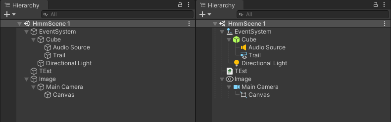
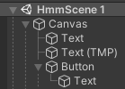
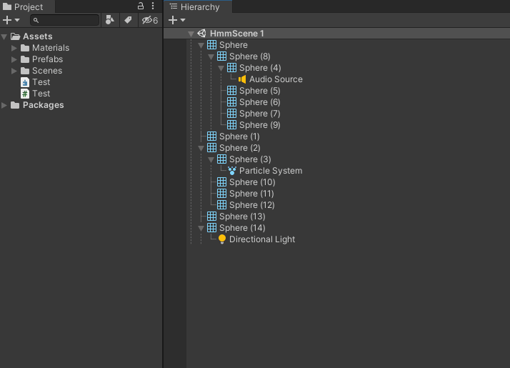

# Hierarchy Window Extensions
This aims to improve the usability of the hierarchy window.

## Installation
- OpenUPM
	- `openupm add com.nomnom.hierarchy-window-extensions`
- Package Manager
	- Add through git url `https://github.com/nomnomab/Hierarchy-Window-Extensions.git`

## Current Enhancements
#### Custom Lines

#### Object Aware Icons

- The first-most component on an object will take priority
  - If the object only has a single component, the transform is shown
  - If it has more than a single component, the next component will be shown
  - Canvas renderer components are ignored for UI so the elements can be seen more clearly

#### Multi-Object Prefab Creation

- Select multiple scene objects, right-click, and select `Prefab/Multi-Prefab` to select a folder for the prefabs to be placed into

### Package Settings
- Parts of this package can be enabled/disabled via the preferences menu, located in `Edit/Preferences/Hierarchy Window Extensions`